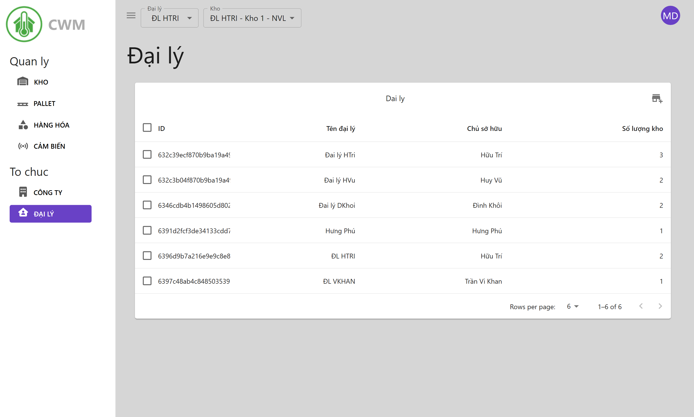
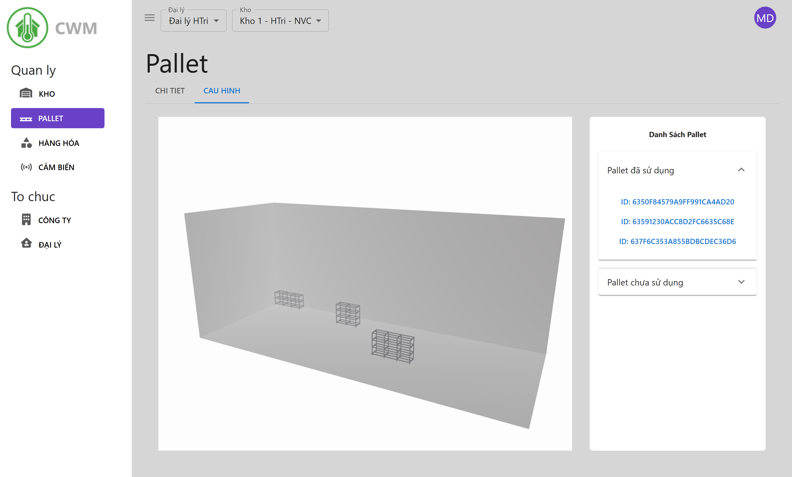
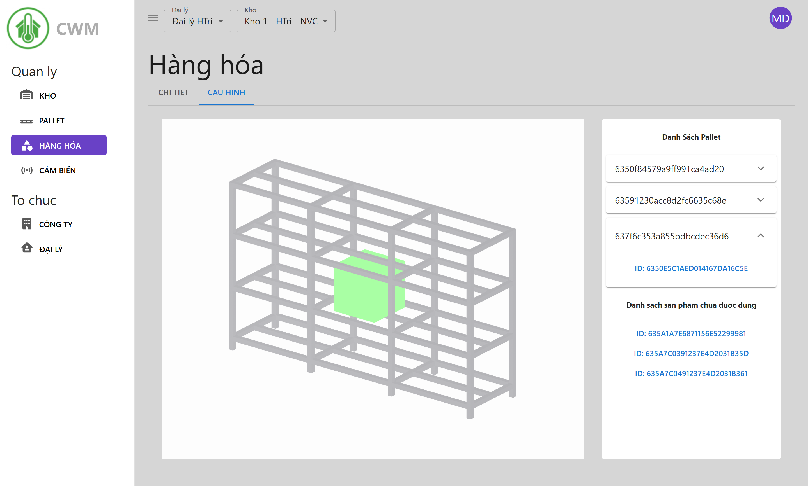
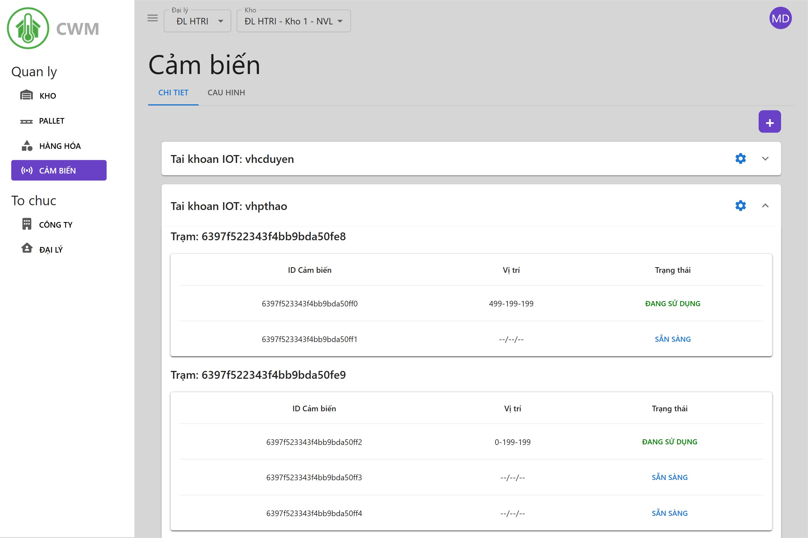
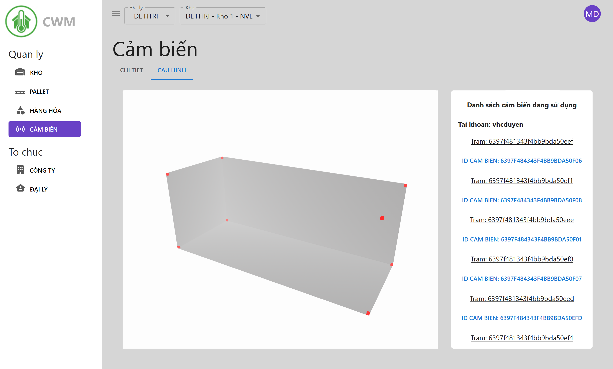

# ❄️ Cold Storage Management System (CSM) ❄️

## Overview

🌟 Welcome to the **Cold Storage Management System (CSM)** — a modern, intuitive web application for managing cold storage warehouses, pallets, products, and IoT sensors.  
🚀 This system empowers organizations to visualize, track, and optimize their cold storage operations with real-time data and interactive 3D interfaces.

> ⚡ **Note:** This frontend requires the [CSM API server](https://github.com/nhttoan0809/CSM-API) to function as its backend.

---

## 🚀 Key Features

### 🏢 Warehouse & Organization Management

- 🏭 Visualize and manage multiple warehouses, agents, and companies.
- 🗺️ Interactive 3D layouts for warehouse and pallet configuration.
- ⚙️ Bulk operations for efficient warehouse management.

### 📦 Pallet & Product Tracking

- 🏷️ Track pallets and products with detailed metadata, positions, and status.
- 🔄 Assign, move, and update pallets and products in real time.
- 🧊 Visualize pallet and product placement in 3D.

### 🌡️ IoT Sensor Integration

- 🌡️ Monitor temperature and sensor data for each warehouse and pallet.
- 🟢 Real-time sensor status and placement visualization.
- 🔗 Integrate with external IoT accounts and stations.

### 🛡️ Secure & Role-Based Access

- 🔐 User authentication and role-based access control.
- 🏢 Organization-level and agent-level permissions.

### 📊 Analytics & Reporting _(coming soon)_

- Generate reports and analytics for warehouse performance and compliance.

---

## 🛠️ Tech Stack

- **Frontend:** React, Material-UI, [React Three Fiber](https://r3f.docs.pmnd.rs/getting-started/introduction), [Three.js](https://threejs.org/) (for 3D visualization)
- **State Management:** React Context API / Redux
- **Routing:** React Router
- **API Communication:** Axios
- **Authentication:** JWT-based (via backend API)
- **Build Tool:** Create React App
- **Design Tool:** Spline (for [Pallet](https://spline.design/) 3D models)

---

## Getting Started

1. Clone this repository.
2. Install dependencies: `npm install`
3. Start the development server: `npm start`
4. Ensure the [CSM API server](https://github.com/nhttoan0809/CSM-API) is running and accessible.

---

## Learn More

- [Create React App Documentation](https://facebook.github.io/create-react-app/docs/getting-started)
- [React Documentation](https://reactjs.org/)
- [Material-UI Documentation](https://mui.com/)
- [React Three Fiber Documentation](https://r3f.docs.pmnd.rs/)
- [Three.js Documentation](https://threejs.org/docs/)
- [Spline Documentation](https://docs.spline.design/)

---

_For backend/API details, see the [CSM API repository](https://github.com/nhttoan0809/CSM-API)._
